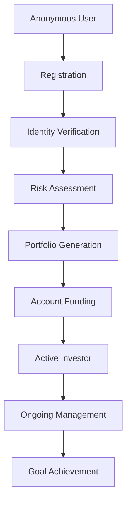
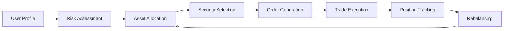
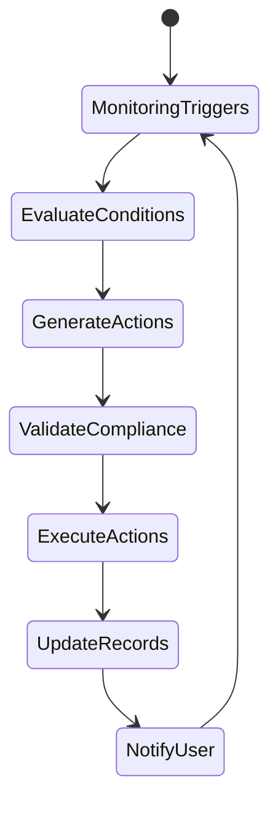
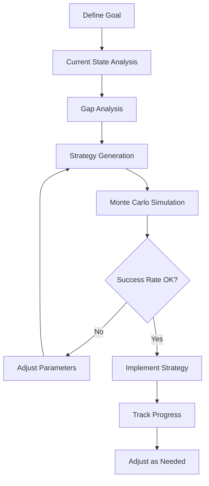
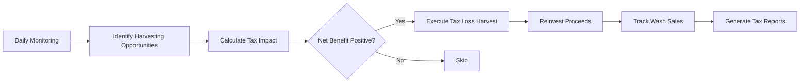
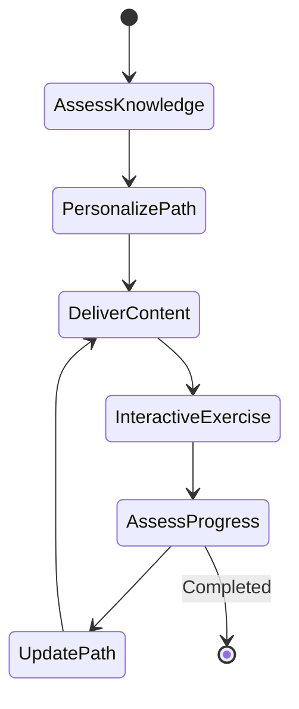
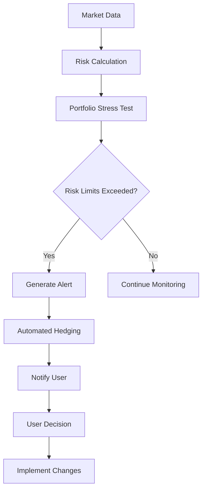
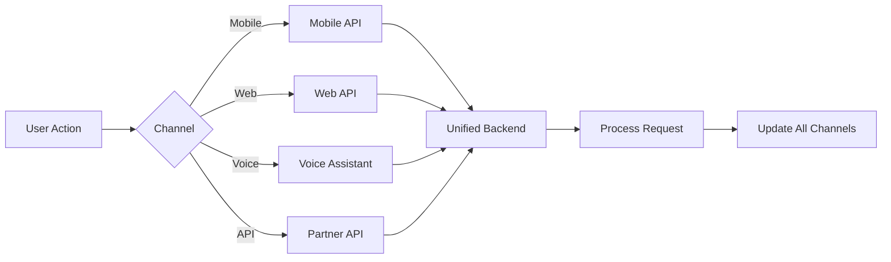
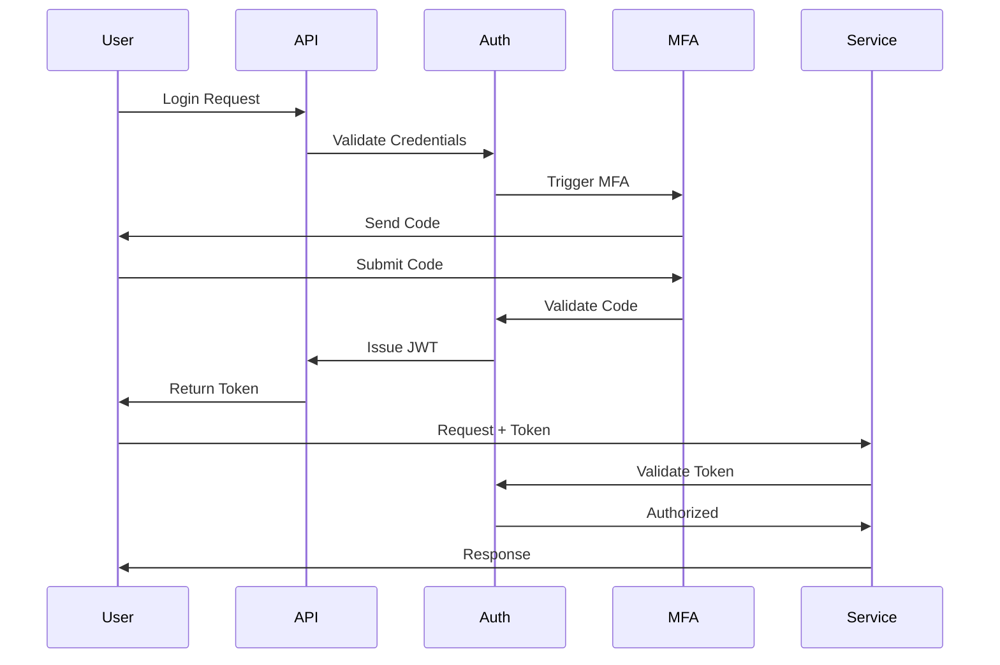

# Consolidated Workflows - Technical Implementation

## Overview
This document consolidates the various user flows into generalizable, reusable workflows that form the technical foundation of the Kronos automated investment system.

## Core Workflow Patterns

### 1. User Lifecycle Workflow



#### Technical Components
- **Authentication Service**: OAuth2, MFA, biometrics
- **KYC/AML Service**: Identity verification, compliance checks
- **Risk Engine**: Questionnaire processing, profile generation
- **Portfolio Engine**: Asset allocation, optimization algorithms
- **Payment Gateway**: ACH, wire, card processing
- **Investment Engine**: Order management, execution

---

### 2. Portfolio Management Workflow



#### Core Services

**Risk Assessment Service**
```python
class RiskAssessmentWorkflow:
    def assess_user_risk(user_data):
        # Age-based risk
        # Goal-based adjustments  
        # Behavioral factors
        # Market conditions
        return risk_profile
```

**Portfolio Construction Service**
```python
class PortfolioConstructionWorkflow:
    def build_portfolio(risk_profile, constraints):
        # Modern Portfolio Theory optimization
        # Factor-based allocation
        # ESG filtering if requested
        # Tax optimization
        return portfolio_weights
```

**Execution Service**
```python
class ExecutionWorkflow:
    def execute_trades(portfolio_delta):
        # Aggregate orders
        # Smart order routing
        # Best execution algorithms
        # Settlement tracking
        return execution_report
```

---

### 3. Automated Investment Workflow



#### Trigger Types
1. **Time-based**: Daily, weekly, monthly processes
2. **Event-based**: Deposits, market moves, goal changes
3. **Threshold-based**: Drift limits, risk changes
4. **User-initiated**: Manual rebalancing, withdrawals

#### Workflow Implementation
```yaml
automated_investment_workflow:
  triggers:
    - schedule: "0 9 * * *"  # Daily at 9 AM
    - event: "deposit_received"
    - threshold: "portfolio_drift > 5%"
  
  actions:
    - evaluate_portfolio_drift
    - calculate_optimal_trades
    - check_tax_implications
    - execute_rebalancing
    - update_user_dashboard
    - send_notification
```

---

### 4. Goal-Based Planning Workflow



#### Goal Types
- **Retirement**: Age, income needs, legacy
- **Major Purchase**: Home, education, wedding
- **Wealth Building**: Target amount, timeframe
- **Income Generation**: Passive income goals

#### Technical Flow
```python
class GoalPlanningWorkflow:
    def create_goal_plan(user, goal_params):
        current_state = analyze_current_position(user)
        required_return = calculate_required_return(goal_params, current_state)
        
        strategies = generate_strategies(required_return, user.risk_profile)
        simulations = run_monte_carlo(strategies, 10000)
        
        optimal_strategy = select_optimal_strategy(simulations)
        return GoalPlan(strategy=optimal_strategy, 
                       success_probability=simulations.success_rate)
```

---

### 5. Tax Optimization Workflow



#### Implementation
```python
class TaxOptimizationWorkflow:
    def daily_tax_optimization(portfolio):
        # Identify positions with losses
        loss_positions = identify_tax_loss_candidates(portfolio)
        
        for position in loss_positions:
            tax_benefit = calculate_tax_benefit(position)
            transaction_cost = estimate_transaction_cost(position)
            
            if tax_benefit > transaction_cost + threshold:
                execute_tax_loss_harvest(position)
                find_replacement_security(position)
                track_wash_sale_rule(position)
```

---

### 6. User Education Workflow



#### Adaptive Learning System
```python
class EducationWorkflow:
    def personalized_learning_path(user):
        knowledge_level = assess_current_knowledge(user)
        learning_style = identify_learning_preferences(user)
        
        curriculum = generate_curriculum(knowledge_level, user.goals)
        
        for module in curriculum:
            content = adapt_content(module, learning_style)
            deliver_content(user, content)
            
            if interactive_exercise_completed(user, module):
                update_knowledge_graph(user, module)
                unlock_next_module(user)
```

---

### 7. Risk Management Workflow



#### Risk Controls
```yaml
risk_management_workflow:
  monitoring:
    - portfolio_var: 95%_confidence
    - maximum_drawdown: 15%
    - concentration_limits:
        single_stock: 5%
        sector: 25%
    - correlation_monitoring: true
  
  actions:
    defensive_rebalancing:
      trigger: "market_volatility > threshold"
      action: "increase_cash_allocation"
    
    stop_loss:
      trigger: "position_loss > 10%"
      action: "evaluate_and_exit"
```

---

### 8. Multi-Channel Integration Workflow



#### Channel Abstraction
```python
class MultiChannelWorkflow:
    def process_user_request(request, channel):
        # Normalize request across channels
        normalized_request = normalize_request(request, channel)
        
        # Process with channel-agnostic logic
        response = process_business_logic(normalized_request)
        
        # Format response for specific channel
        formatted_response = format_for_channel(response, channel)
        
        # Sync across all user channels
        sync_all_channels(request.user_id, response)
        
        return formatted_response
```

---

## Workflow Orchestration

### Master Orchestration Pattern

```python
class WorkflowOrchestrator:
    def __init__(self):
        self.workflows = {
            'onboarding': OnboardingWorkflow(),
            'investment': InvestmentWorkflow(),
            'rebalancing': RebalancingWorkflow(),
            'tax_optimization': TaxOptimizationWorkflow(),
            'goal_planning': GoalPlanningWorkflow(),
            'risk_management': RiskManagementWorkflow()
        }
    
    async def execute_workflow(self, workflow_type, context):
        workflow = self.workflows[workflow_type]
        
        # Pre-execution validation
        await self.validate_preconditions(workflow, context)
        
        # Execute with monitoring
        result = await self.execute_with_monitoring(workflow, context)
        
        # Post-execution actions
        await self.handle_post_execution(workflow, result)
        
        return result
```

---

## Event-Driven Architecture

### Core Event Types

```yaml
events:
  user_events:
    - user_registered
    - profile_updated
    - goal_created
    - deposit_initiated
  
  market_events:
    - market_open
    - market_close
    - volatility_spike
    - major_news_event
  
  portfolio_events:
    - drift_exceeded
    - goal_milestone_reached
    - risk_limit_breached
    - rebalancing_needed
  
  system_events:
    - daily_batch_start
    - monthly_statement_generation
    - tax_document_ready
    - compliance_check_required
```

### Event Processing

```python
class EventProcessor:
    async def process_event(self, event):
        # Route to appropriate handlers
        handlers = self.get_handlers(event.type)
        
        # Execute handlers in parallel where possible
        results = await asyncio.gather(*[
            handler.handle(event) for handler in handlers
        ])
        
        # Emit derived events
        for result in results:
            if result.triggers_new_events:
                await self.emit_events(result.new_events)
```

---

## Scalability Patterns

### Horizontal Scaling Strategy

```yaml
scaling_strategy:
  services:
    - name: portfolio_engine
      scaling_metric: cpu_usage
      min_instances: 3
      max_instances: 100
      scale_up_threshold: 70%
      scale_down_threshold: 30%
    
    - name: execution_engine
      scaling_metric: queue_depth
      min_instances: 5
      max_instances: 50
      scale_up_threshold: 1000_messages
      scale_down_threshold: 100_messages
```

### Data Partitioning

```python
class DataPartitioningStrategy:
    def get_partition_key(self, user_id):
        # Partition by user_id for even distribution
        return hash(user_id) % self.num_partitions
    
    def get_time_series_partition(self, timestamp):
        # Partition by time for historical data
        return timestamp.strftime('%Y-%m')
```

---

## Security Workflows

### Authentication & Authorization



---

## Monitoring & Observability

### Key Metrics

```yaml
metrics:
  business:
    - workflow_completion_rate
    - average_workflow_duration
    - error_rate_by_workflow
    - user_satisfaction_by_workflow
  
  technical:
    - api_latency_p99
    - database_query_time
    - cache_hit_rate
    - message_queue_depth
  
  financial:
    - daily_trade_volume
    - rebalancing_frequency
    - tax_savings_generated
    - goal_achievement_rate
```

## Conclusion

These consolidated workflows provide the technical foundation for implementing the Kronos automated investment system. Each workflow is designed to be:

1. **Modular** - Can be composed and reused
2. **Scalable** - Handles growth in users and data
3. **Resilient** - Fails gracefully with recovery
4. **Observable** - Full monitoring and tracing
5. **Secure** - Defense in depth approach
6. **Performant** - Optimized for low latency