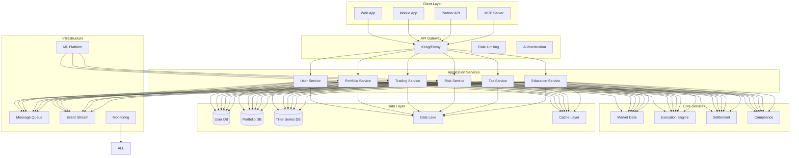
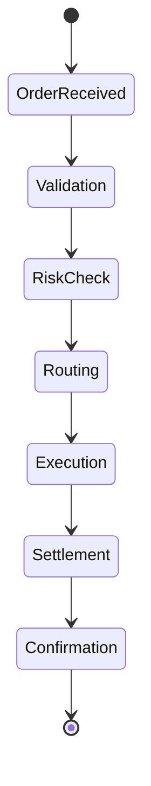
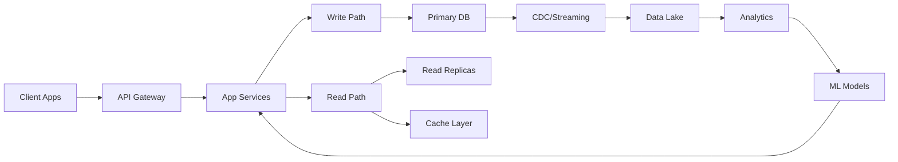
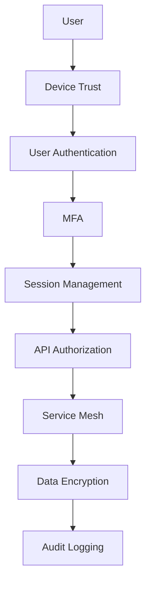

# System Architecture - Kronos Automated Investment Platform

## Overview
This document outlines the high-level technical architecture for the Kronos automated investment system, designed to support millions of users with real-time portfolio management, automated trading, and personalized investment strategies.

## Architecture Principles

1. **Microservices Architecture** - Loosely coupled, independently deployable services
2. **Event-Driven Design** - Asynchronous communication via event streaming
3. **Cloud-Native** - Containerized, orchestrated, and auto-scaling
4. **Security-First** - Zero-trust architecture with defense in depth
5. **Data-Driven** - ML/AI at the core of decision making

---

## High-Level Architecture



---

## Component Architecture

### 1. Client Layer

#### Web Application
- **Technology**: React/Next.js with TypeScript
- **State Management**: Redux/MobX
- **Real-time**: WebSocket for live updates
- **PWA**: Offline capability

#### Mobile Application
- **Technology**: React Native / Flutter
- **Biometric Auth**: FaceID/TouchID
- **Push Notifications**: Firebase
- **Offline Sync**: Local SQLite

#### Partner API
- **Protocol**: REST and GraphQL
- **Authentication**: OAuth2 + API Keys
- **Rate Limiting**: Tiered based on partner
- **Webhooks**: Event notifications

#### MCP Server (Kailash Integration)
- **Framework**: Kailash SDK MCP nodes
- **Workflows**: Investment automation
- **Integration**: Direct portfolio access

---

### 2. API Gateway Layer

```yaml
api_gateway:
  features:
    - request_routing
    - load_balancing
    - authentication
    - rate_limiting
    - request_transformation
    - response_caching
    - api_versioning
    - circuit_breaking
  
  security:
    - jwt_validation
    - api_key_management
    - ip_whitelisting
    - ddos_protection
    - ssl_termination
```

---

### 3. Application Services

#### User Service
```python
class UserService:
    endpoints = [
        "POST /users/register",
        "POST /users/login",
        "GET /users/{id}/profile",
        "PUT /users/{id}/profile",
        "POST /users/{id}/kyc",
        "POST /users/{id}/risk-assessment"
    ]
    
    dependencies = [
        "AuthService",
        "KYCService",
        "NotificationService"
    ]
```

#### Portfolio Service
```python
class PortfolioService:
    endpoints = [
        "GET /portfolios/{id}",
        "POST /portfolios/optimize",
        "GET /portfolios/{id}/performance",
        "POST /portfolios/{id}/rebalance",
        "GET /portfolios/{id}/holdings"
    ]
    
    dependencies = [
        "MarketDataService",
        "OptimizationEngine",
        "RiskService"
    ]
```

#### Trading Service
```python
class TradingService:
    endpoints = [
        "POST /trades/execute",
        "GET /trades/{id}/status",
        "POST /trades/bulk",
        "GET /trades/history"
    ]
    
    features = [
        "smart_order_routing",
        "best_execution",
        "fractional_shares",
        "dark_pool_access"
    ]
```

---

### 4. Core Services

#### Market Data Service
```yaml
market_data_service:
  data_sources:
    - name: "Primary Provider"
      types: [equities, etfs, mutual_funds]
      latency: <10ms
    - name: "Backup Provider"
      types: [all]
      latency: <50ms
  
  features:
    - real_time_quotes
    - historical_data
    - corporate_actions
    - news_sentiment
    - fundamental_data
```

#### Execution Engine


---

### 5. Data Architecture

#### Database Strategy

```yaml
databases:
  postgresql:
    purpose: "Transactional data"
    data:
      - user_profiles
      - account_details
      - transaction_history
    features:
      - multi_region_replication
      - point_in_time_recovery
      - encryption_at_rest
  
  timescaledb:
    purpose: "Time-series data"
    data:
      - market_prices
      - portfolio_values
      - performance_metrics
    retention:
      - raw_data: 1_year
      - aggregated: 10_years
  
  redis:
    purpose: "Caching & sessions"
    data:
      - user_sessions
      - portfolio_snapshots
      - market_data_cache
    ttl:
      - sessions: 24_hours
      - market_data: 1_minute
  
  s3_data_lake:
    purpose: "Analytics & ML"
    data:
      - user_behavior
      - market_history
      - ml_training_data
    format:
      - parquet_files
      - organized_by_date
```

#### Data Flow Architecture



---

### 6. Machine Learning Platform

#### ML Architecture

```python
class MLPlatform:
    models = {
        "risk_assessment": {
            "type": "classification",
            "features": ["age", "income", "goals", "behavior"],
            "update_frequency": "weekly"
        },
        "portfolio_optimization": {
            "type": "optimization",
            "algorithm": "mean_variance_optimization",
            "constraints": ["risk_budget", "sector_limits"]
        },
        "fraud_detection": {
            "type": "anomaly_detection",
            "real_time": True,
            "threshold": 0.95
        },
        "churn_prediction": {
            "type": "classification",
            "features": ["engagement", "performance", "support_tickets"],
            "action_threshold": 0.7
        }
    }
```

#### Feature Store

```yaml
feature_store:
  real_time_features:
    - current_portfolio_value
    - recent_transaction_count
    - market_volatility_index
  
  batch_features:
    - historical_returns
    - risk_metrics
    - user_behavior_patterns
  
  storage:
    online: redis
    offline: parquet_on_s3
```

---

### 7. Event-Driven Architecture

#### Event Streaming Platform

```yaml
event_streaming:
  platform: Apache_Kafka
  topics:
    - name: user_events
      partitions: 100
      retention: 7_days
    
    - name: market_events
      partitions: 50
      retention: 1_day
    
    - name: portfolio_events
      partitions: 200
      retention: 30_days
    
    - name: compliance_events
      partitions: 10
      retention: 7_years
  
  consumers:
    - portfolio_aggregator
    - risk_calculator
    - tax_processor
    - notification_service
```

---

### 8. Security Architecture

#### Zero-Trust Security Model



#### Security Layers

```yaml
security_layers:
  network:
    - waf: "AWS WAF"
    - ddos: "CloudFlare"
    - vpc: "Private subnets"
    - firewall: "Security groups"
  
  application:
    - authentication: "OAuth2 + JWT"
    - authorization: "RBAC + ABAC"
    - encryption: "TLS 1.3"
    - secrets: "HashiCorp Vault"
  
  data:
    - encryption_at_rest: "AES-256"
    - encryption_in_transit: "TLS"
    - key_management: "AWS KMS"
    - data_masking: "PII protection"
  
  compliance:
    - standards: ["SOC2", "PCI-DSS", "GDPR"]
    - auditing: "Continuous"
    - penetration_testing: "Quarterly"
```

---

### 9. Infrastructure Architecture

#### Cloud Infrastructure

```yaml
infrastructure:
  cloud_provider: AWS
  regions:
    primary: us-east-1
    dr: us-west-2
    international:
      - eu-west-1
      - ap-southeast-1
  
  compute:
    orchestration: Kubernetes_EKS
    container_runtime: Docker
    service_mesh: Istio
    autoscaling:
      - horizontal_pod_autoscaler
      - cluster_autoscaler
      - vertical_pod_autoscaler
  
  networking:
    cdn: CloudFront
    load_balancer: ALB/NLB
    dns: Route53
    vpn: Site-to-site
```

#### Deployment Pipeline

```mermaid
graph LR
    A[Code Commit] --> B[Build]
    B --> C[Unit Tests]
    C --> D[Integration Tests]
    D --> E[Security Scan]
    E --> F[Container Build]
    F --> G[Push to Registry]
    G --> H[Deploy to Dev]
    H --> I[E2E Tests]
    I --> J[Deploy to Staging]
    J --> K[Performance Tests]
    K --> L[Manual Approval]
    L --> M[Deploy to Prod]
    M --> N[Health Checks]
    N --> O[Rollback if Needed]
```



---

### 10. Monitoring & Observability

#### Observability Stack

```yaml
observability:
  metrics:
    collection: Prometheus
    storage: Cortex
    visualization: Grafana
    alerts: AlertManager
  
  logging:
    collection: Fluent_Bit
    aggregation: Elasticsearch
    visualization: Kibana
    retention: 30_days
  
  tracing:
    instrumentation: OpenTelemetry
    collection: Jaeger
    sampling_rate: 0.1%
  
  synthetic_monitoring:
    tool: Datadog_Synthetics
    checks:
      - api_availability
      - user_flows
      - global_latency
```

#### SLOs and Error Budgets

```yaml
slos:
  api_availability:
    target: 99.95%
    measurement_window: 30_days
    error_budget_policy: "Freeze deployments"
  
  trade_execution_latency:
    target: "p99 < 100ms"
    measurement_window: 7_days
  
  portfolio_calculation_accuracy:
    target: 99.99%
    measurement_window: 24_hours
```

---

## Disaster Recovery

### DR Strategy

```yaml
disaster_recovery:
  rto: 1_hour  # Recovery Time Objective
  rpo: 5_minutes  # Recovery Point Objective
  
  backup_strategy:
    databases:
      frequency: continuous
      retention: 30_days
      testing: weekly
    
    object_storage:
      replication: cross_region
      versioning: enabled
  
  failover:
    automatic: true
    health_checks: 3_failures
    dns_ttl: 60_seconds
```

---

## Scalability Considerations

### Scaling Metrics

```yaml
scaling_targets:
  users: 10_million
  daily_active_users: 3_million
  trades_per_second: 10000
  portfolios_under_management: 10_million
  assets_under_management: $100_billion
  
  technical_requirements:
    api_latency_p99: <100ms
    throughput: 1_million_requests_per_minute
    data_storage: 10_petabytes
    concurrent_connections: 1_million
```

---

## Technology Stack Summary

| Layer | Technology | Purpose |
|-------|------------|----------|
| Frontend | React, React Native | Web and mobile apps |
| API | GraphQL, REST | Client communication |
| Backend | Python, Go | Service implementation |
| ML/AI | Python, TensorFlow | Intelligence layer |
| Streaming | Kafka | Event processing |
| Databases | PostgreSQL, TimescaleDB | Data persistence |
| Cache | Redis | Performance optimization |
| Search | Elasticsearch | Full-text search |
| Infrastructure | Kubernetes, Docker | Container orchestration |
| Cloud | AWS | Infrastructure provider |
| Monitoring | Prometheus, Grafana | Observability |
| Security | Vault, KMS | Secrets and encryption |