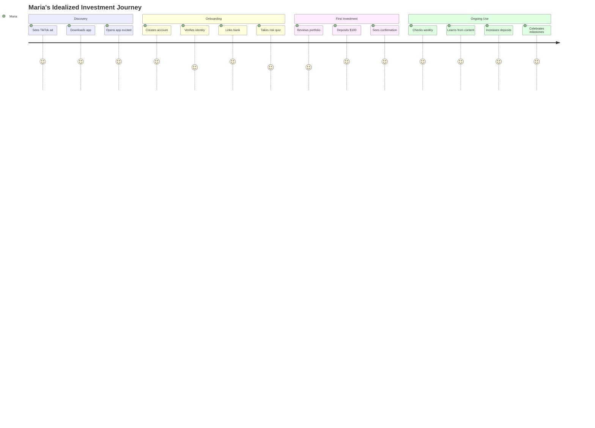
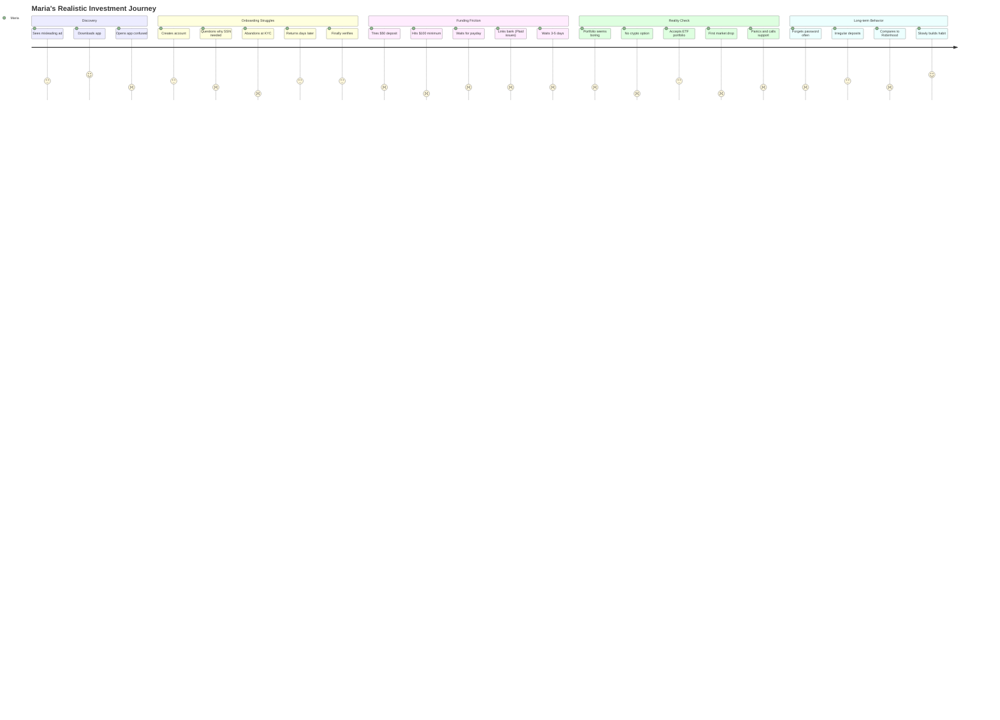

# User Journey Mapping

## Overview
This document provides detailed user journey maps for each key persona, showing both the idealized journey and the realistic journey with all friction points, failures, and workarounds.

---

## 1. New Investor Journey (Maria Rodriguez)

### Persona Context
- **Age**: 24, Recent college graduate
- **Tech Savviness**: High (mobile-first)
- **Investment Knowledge**: Minimal
- **Initial Investment**: $100-200
- **Goal**: Start building wealth

### Idealized Journey (Original Vision)



### Realistic Journey (With Friction Points)



### Journey Phases & Requirements

#### Phase 1: Discovery & Acquisition
**Touchpoints**:
- Social media ads (TikTok, Instagram)
- Friend referrals
- App store search
- Financial influencers

**Requirements Mapping**:
- REQ-UI-001: Responsive landing page
- REQ-AUTH-001: Quick signup option
- REQ-MVP-004: Simple value proposition

**Friction Points**:
- Misleading "get rich quick" messaging
- Competitors with crypto/meme stocks
- Trust concerns ("Is this legit?")

**Success Metrics**:
- App install rate: 20% of ad clicks
- Signup start rate: 50% of installs
- Completion rate: 30% of starts

#### Phase 2: Onboarding & Activation
**Touchpoints**:
- Account creation
- Identity verification
- Risk assessment
- Bank connection
- First deposit

**Requirements Mapping**:
- REQ-AUTH-002: Email verification
- REQ-KYC-001: Identity verification
- REQ-ACC-002: ACH funding
- REQ-PORT-001: Risk assessment

**Major Friction Points**:
- SSN requirement causes 40% drop-off
- $100 minimum beyond budget
- 3-5 day wait for first investment
- Boring portfolio options
- No instant gratification

**Workarounds Needed**:
- Education on why SSN required
- Lower minimum to $10 (regulatory allowing)
- Show paper trading while waiting
- Gamification elements
- Success stories from peers

#### Phase 3: Ongoing Engagement
**Touchpoints**:
- Weekly app checks
- Monthly deposits
- Educational content
- Community features
- Milestone celebrations

**Requirements Mapping**:
- REQ-UI-001: Engaging dashboard
- REQ-SUPP-003: Smart notifications
- REQ-REPORT-004: Simple analytics

**Retention Challenges**:
- Forgot password (30% monthly)
- Market volatility scares
- Competing priorities (student loans)
- FOMO on crypto/memes
- Slow wealth building

**Engagement Strategies**:
- Biometric login
- Market volatility education
- Micro-investing features
- Social proof elements
- Achievement system

### Success Criteria for Maria's Journey
- **Onboarding**: Complete in 2 sessions over 1 week
- **First Investment**: Within 10 days of download
- **3-Month Retention**: 60% still active
- **12-Month Growth**: Average balance $1,000+
- **Referrals**: 0.5 per active user

---

## 2. Busy Professional Journey (Sarah Chen)

### Persona Context
- **Age**: 32, Software Engineer
- **Tech Savviness**: Very High
- **Investment Knowledge**: Moderate
- **Initial Investment**: $5,000 + $2,000/month
- **Goal**: Automated wealth building

### Journey Map with Reality Check

#### Pre-Purchase Research Phase
**Duration**: 2-4 weeks

**Activities**:
1. Googles "best robo advisor 2024"
2. Reads comparison articles
3. Checks Reddit r/personalfinance
4. Compares fees and features
5. Reads negative reviews carefully

**Decision Factors**:
- Fee comparison (matters even at 0.25%)
- Integration with existing tools
- Mobile app quality
- Customer service availability
- Security track record

**Requirements Mapping**:
- Public website with clear pricing
- Security certifications visible
- Real customer testimonials
- Fee calculator tool

#### Onboarding Phase
**Duration**: Started over 3 lunch breaks

**Session 1 (Day 1, 15 minutes)**:
- Creates account on mobile
- Starts KYC process
- Interrupted by meeting
- Progress saved

**Session 2 (Day 3, 20 minutes)**:
- Completes KYC
- Takes risk assessment
- Reviews suggested portfolio
- Starts bank connection

**Session 3 (Day 5, 10 minutes)**:
- Plaid connection fails first time
- Tries different bank
- Sets up $2,000/month auto-invest
- Submits everything

**Waiting Period (Days 6-10)**:
- Receives compliance approval
- ACH verification delays
- First investment executes
- Slightly frustrated by delays

**Requirements Mapping**:
- REQ-AUTH-003: Session persistence
- REQ-KYC-001: Streamlined verification
- REQ-ACC-002: Reliable bank connections
- REQ-UI-003: Mobile-optimized flows

#### Steady State Usage
**Frequency**: Monthly check-in (5 minutes)

**Typical Session**:
1. Face ID login
2. Check total balance
3. View performance chart
4. Close app

**Quarterly Actions**:
- Adjust auto-invest amount
- Download tax documents
- Consider rebalancing
- Maybe read one article

**Annual Actions**:
- Tax document download
- Bonus investment
- Strategy review
- Beneficiary update

**Pain Points**:
- Password reset 3-4x per year
- Unclear tax implications
- Wants more customization
- Compares to self-directed constantly

---

## 3. Retirement Planner Journey (Robert Williams)

### Persona Context
- **Age**: 55, Middle Manager
- **Tech Savviness**: Low-Moderate
- **Investment Knowledge**: Moderate
- **Assets**: $500,000 to transfer
- **Goal**: Secure retirement in 10 years

### Complex Journey with Multiple Stakeholders

#### Research & Validation Phase
**Duration**: 2-3 months

**Activities**:
1. Asks financial advisor friend
2. Discusses with spouse (3+ conversations)
3. Calls customer service (45-min wait)
4. Requests paper brochures
5. Attends webinar
6. Checks BBB rating
7. Verifies SIPC insurance

**Trust Builders Needed**:
- Human phone support
- Physical address
- Clear SIPC/regulatory info
- Advisor credentials
- Conservative messaging

#### Complex Onboarding
**Duration**: 3-4 weeks

**Week 1: Initial Setup**
- Schedules call with advisor
- Gathers financial documents
- Creates account with spouse
- Struggles with 2FA setup

**Week 2: Planning Session**
- 90-minute video call
- Reviews retirement goals
- Discovers needs $2M (has $500K)
- Adjusts expectations down
- Agrees to modified plan

**Week 3-4: IRA Transfer**
- Fills out transfer forms
- Form rejected - signature issue
- Visits bank for medallion signature
- Resubmits forms
- Waits anxiously
- Calls twice for status

**Requirements Mapping**:
- Human advisor support
- Joint account handling
- IRA transfer expertise
- Document management
- Status tracking

#### Ongoing Relationship

**Monthly Behaviors**:
- Checks balance anxiously
- Worries about market drops
- Forwards articles to advisor
- Questions every fee

**Quarterly Reviews**:
- Scheduled calls (often rescheduled)
- Rebalancing explanations needed
- Tax surprise discussions
- Benchmark comparisons

**Critical Moments**:
- First market downturn: Panic call
- Rebalancing tax hit: Trust damaged
- Advisor change: Considers leaving
- 5 years out: Anxiety peaks

**Support Intensive**:
- 10x more support than average
- Prefers phone to digital
- Needs constant reassurance
- Involves spouse in decisions

---

## 4. Common Journey Patterns

### The Trust Ladder
```
Level 1: Research (1-4 weeks)
- Read reviews
- Check regulations
- Verify insurance

Level 2: Test (2-4 weeks)
- Small initial deposit
- Monitor closely
- Read all communications

Level 3: Commit (2-6 months)
- Increase deposits
- Set up automation
- Reduce monitoring

Level 4: Advocate (6+ months)
- Refer friends
- Leave positive reviews
- Increase investment
```

### The Abandonment Cliff
```
Highest Drop-off Points:
1. SSN Request: 40% abandon
2. $100 Minimum: 25% abandon
3. ACH Wait: 20% abandon
4. First Loss: 15% abandon
5. Fee Discovery: 10% abandon
```

### The Support Spiral
```
Trigger Event:
- Market drop
- Unexpected fee
- Tax surprise
- Technical issue

Spiral Pattern:
1. In-app help (not helpful)
2. Email support (slow response)
3. Social media complaint
4. Negative review
5. Account closure threat
```

---

## 5. Journey-Based Requirements

### Reduce Friction Requirements
1. **Progressive KYC**: Collect minimum info upfront
2. **Instant Gratification**: Paper trading while waiting
3. **Smart Nudges**: Education at friction points
4. **Flexible Minimums**: Start with $10 if possible
5. **Status Transparency**: Clear progress indicators

### Build Trust Requirements
1. **Security Badges**: Display prominently
2. **Human Touch**: Advisor calls for large accounts
3. **Social Proof**: Real customer stories
4. **Regulatory Info**: Easy to find and understand
5. **Insurance Details**: SIPC coverage explained

### Maintain Engagement Requirements
1. **Smart Notifications**: Personalized and timely
2. **Quick Wins**: Celebrate small milestones
3. **Education Drips**: Relevant content delivery
4. **Community Features**: Peer comparisons
5. **Gamification**: Appropriate achievements

### Support Excellence Requirements
1. **Omnichannel**: Phone, chat, email, social
2. **Context Aware**: Know customer history
3. **Proactive**: Reach out during volatility
4. **Self-Service**: Comprehensive help center
5. **Fast Resolution**: 24-hour SLA

---

## Success Metrics by Journey Stage

### Acquisition Stage
- **Landing → Signup**: 30% conversion
- **Signup → KYC Start**: 80% conversion
- **KYC Start → Complete**: 60% conversion

### Activation Stage
- **KYC Complete → Funded**: 60% conversion
- **Funded → First Investment**: 95% conversion
- **Time to First Investment**: <7 days

### Retention Stage
- **1-Month Retention**: 85%
- **3-Month Retention**: 70%
- **12-Month Retention**: 60%
- **24-Month Retention**: 50%

### Growth Stage
- **Deposit Increase Rate**: 20% yearly
- **Referral Rate**: 0.3 per user/year
- **Additional Product Adoption**: 25%
- **NPS Score**: 50+

---

## Implementation Priority

### Phase 1 (MVP) - Critical Journeys
1. Simplify new investor onboarding
2. Basic busy professional automation
3. Email-only support journey

### Phase 2 - Trust Building
1. Retirement planner high-touch support
2. Progressive disclosure onboarding
3. Multi-channel support

### Phase 3 - Optimization
1. Personalized journeys by segment
2. Predictive intervention
3. Journey automation
4. Continuous optimization