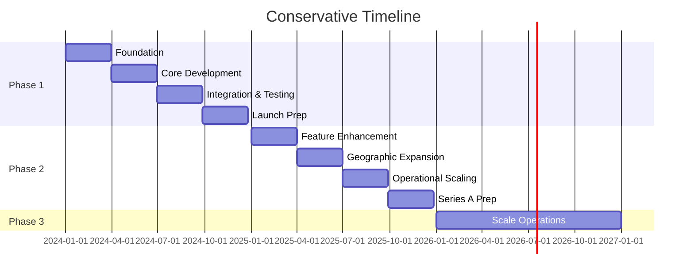

# Implementation Roadmap

## Overview
This document provides a detailed implementation roadmap for the Kronos automated investment platform, broken down by MVP, Growth, and Scale phases with specific requirements, deliverables, and success criteria.

---

## Phase Overview

### Timeline Summary
- **Phase 1 (MVP)**: Months 1-12 - Launch in single state with basic features
- **Phase 2 (Growth)**: Months 13-24 - Multi-state expansion and feature enhancement  
- **Phase 3 (Scale)**: Year 3+ - National presence and advanced capabilities

### Investment Requirements
- **Phase 1**: $3M seed funding
- **Phase 2**: $15M Series A
- **Phase 3**: $40M Series B

---

## Phase 1: MVP (Months 1-12)

### Goal
Launch a minimal viable investment platform in Nevada with manual operations and basic features to validate product-market fit.

### Month 1-3: Foundation

#### Legal & Compliance Setup
**Requirements**:
- REQ-LEGAL-001: Delaware C-Corp formation
- REQ-LEGAL-002: Nevada state registration filing
- REQ-LEGAL-003: Custodian partnership agreement
- REQ-LEGAL-004: Basic compliance policies

**Deliverables**:
```yaml
legal_deliverables:
  - incorporation_documents
  - state_registration_filed
  - custodian_contract_signed
  - compliance_manual_v1
  - privacy_policy
  - terms_of_service
```

**Team Building**:
| Role | Requirements | Priority |
|------|-------------|----------|
| CEO | Financial services experience, Series 7/66 | Critical |
| Chief Compliance Officer | 5+ years RIA experience | Critical |
| CTO | Fintech background, Python/AWS | Critical |
| Backend Engineer | Python, financial systems | High |
| Product Designer | Financial UX experience | High |

#### Technical Foundation
**Kailash SDK Setup**:
```python
# Initial project structure
kronos/
├── workflows/
│   ├── onboarding.py
│   ├── portfolio.py
│   └── compliance.py
├── nodes/
│   ├── kyc.py
│   ├── portfolio.py
│   └── trading.py
├── config/
│   ├── development.yaml
│   ├── staging.yaml
│   └── production.yaml
└── tests/
    ├── unit/
    └── integration/
```

**Infrastructure Setup**:
```yaml
aws_infrastructure:
  region: us-west-2
  services:
    - vpc: Multi-AZ setup
    - rds: PostgreSQL 15
    - ecs: Fargate cluster
    - s3: Document storage
    - cloudwatch: Basic monitoring
```

### Month 4-6: Core Development

#### MVP Feature Set
**User Management**:
- REQ-AUTH-001: Email/password authentication
- REQ-AUTH-002: Email verification
- REQ-KYC-001: Basic KYC via Jumio
- REQ-ACC-001: Individual taxable accounts only

**Portfolio Management**:
- REQ-MVP-001: Three fixed portfolios (30/70, 60/40, 80/20)
- REQ-MVP-002: Manual quarterly rebalancing
- REQ-PORT-001: 5-question risk assessment

**Account Funding**:
- REQ-MVP-005: ACH transfers only via Plaid
- REQ-ACC-002: $100 minimum initial deposit

**User Interface**:
- REQ-MVP-004: Basic web dashboard showing:
  - Total account value
  - Simple performance chart
  - Deposit/withdraw functions

**Kailash Workflow Implementation**:
```python
class MVPOnboardingWorkflow:
    def __init__(self):
        self.workflow = WorkflowBuilder()
        
    def build(self):
        # User registration
        self.workflow.add_node(
            "ValidateUserData",
            "validate_user",
            {"required_fields": ["email", "password", "phone"]}
        )
        
        # KYC verification
        self.workflow.add_node(
            "KYCVerificationNode",
            "verify_identity",
            {"provider": "jumio", "level": "basic"}
        )
        
        # Risk assessment
        self.workflow.add_node(
            "RiskAssessmentNode",
            "assess_risk",
            {"questions": 5, "strategy": "simple"}
        )
        
        # Account creation
        self.workflow.add_node(
            "CreateAccountNode",
            "create_account",
            {"type": "individual_taxable", "custodian": "apex"}
        )
        
        return self.workflow.build()
```

### Month 7-9: Integration & Testing

#### Third-Party Integrations
**Custodian Integration (Apex Clearing)**:
```python
class ApexIntegrationNode:
    """Custom node for Apex Clearing integration"""
    
    def execute(self, inputs):
        # Account opening
        apex_account = self.apex_client.create_account({
            "tax_id": inputs["ssn"],
            "account_type": "INDIVIDUAL",
            "email": inputs["email"]
        })
        
        # Store mapping
        self.store_account_mapping(
            internal_id=inputs["account_id"],
            apex_id=apex_account["id"]
        )
        
        return {"apex_account_id": apex_account["id"]}
```

**Banking Integration (Plaid)**:
```python
class PlaidFundingNode:
    """ACH funding via Plaid"""
    
    def execute(self, inputs):
        # Link bank account
        link_token = self.plaid_client.create_link_token(
            user_id=inputs["user_id"]
        )
        
        # After user completes Plaid Link
        public_token = inputs["public_token"]
        access_token = self.plaid_client.exchange_token(public_token)
        
        # Initiate ACH
        transfer = self.plaid_client.initiate_ach(
            access_token=access_token,
            amount=inputs["amount"],
            direction="push"
        )
        
        return {"transfer_id": transfer["id"]}
```

#### Testing Strategy
**Test Coverage Requirements**:
```yaml
testing_requirements:
  unit_tests:
    coverage: 80%
    focus_areas:
      - Financial calculations
      - Compliance rules
      - Data validation
  
  integration_tests:
    coverage: 100%_critical_paths
    areas:
      - Custodian API
      - Banking integration
      - KYC verification
  
  end_to_end_tests:
    scenarios:
      - Complete onboarding
      - Fund account
      - View portfolio
      - Request withdrawal
```

### Month 10-12: Launch Preparation

#### Compliance Validation
**Pre-Launch Checklist**:
- [ ] Nevada registration approved
- [ ] Compliance policies reviewed by counsel
- [ ] ADV Part 2 filed
- [ ] Custodial agreement active
- [ ] E&O insurance in place
- [ ] Cybersecurity insurance obtained

#### Operational Readiness
**Manual Processes Documentation**:
```yaml
manual_operations:
  daily_tasks:
    - reconciliation_check: 9am
    - trade_review: 3pm
    - system_health_check: 5pm
  
  weekly_tasks:
    - compliance_review: Monday
    - rebalancing_analysis: Wednesday
    - customer_issue_review: Friday
  
  support_process:
    - email_only_support
    - 24hr_response_sla
    - escalation_to_CCO
```

#### Soft Launch
**Beta Testing Plan**:
1. **Week 1-2**: Internal team accounts (10 users)
2. **Week 3-4**: Friends and family (50 users)
3. **Week 5-8**: Limited public beta (100 users)

**Success Criteria**:
- Zero compliance violations
- <5% account funding failure rate
- System uptime >99%
- Customer satisfaction >80%

---

## Phase 2: Growth (Months 13-24)

### Goal
Achieve product-market fit with enhanced features, multi-state expansion, and path to profitability.

### Month 13-15: Feature Enhancement

#### New Features
**Account Types**:
- REQ-ACC-006: Traditional IRA accounts
- REQ-ACC-007: Roth IRA accounts

**Portfolio Features**:
- REQ-PORT-003: Automated weekly rebalancing
- REQ-PORT-004: Basic tax-loss harvesting
- REQ-PORT-006: ESG portfolio option

**Mobile Experience**:
- REQ-UI-005: iOS app (React Native)
- REQ-UI-002: Biometric authentication

**Enhanced Workflows**:
```python
class TaxLossHarvestingWorkflow:
    def build(self):
        # Identify harvest opportunities
        self.workflow.add_node(
            "IdentifyLossesNode",
            "find_losses",
            {"threshold": 100, "wash_sale_check": True}
        )
        
        # Generate tax-efficient trades
        self.workflow.add_node(
            "TaxOptimizedTradesNode",
            "generate_trades",
            {"strategy": "specific_identification"}
        )
        
        # Execute and track
        self.workflow.add_node(
            "ExecuteHarvestNode",
            "execute_harvest",
            {"track_wash_sales": True}
        )
```

### Month 16-18: Geographic Expansion

#### Multi-State Registration
**Target States**:
1. Texas (no state income tax)
2. California (large market)
3. Washington (tech hub)

**State-Specific Requirements**:
```yaml
state_requirements:
  california:
    - ccpa_compliance
    - state_registration
    - surety_bond_25000
  
  texas:
    - state_notice_filing
    - no_additional_requirements
  
  washington:
    - state_registration
    - net_worth_requirement_35000
```

### Month 19-21: Operational Scaling

#### Automation Implementation
**From Manual to Automated**:
| Process | Current (Manual) | Target (Automated) |
|---------|-----------------|-------------------|
| Rebalancing | Quarterly review | Weekly automated |
| Reconciliation | Daily spreadsheet | Real-time system |
| Compliance monitoring | Weekly spot checks | Continuous monitoring |
| Customer onboarding | 3-day process | Same-day completion |

**Service Architecture Migration**:
```yaml
service_separation:
  phase_2_services:
    - user_service: Authentication, profiles
    - portfolio_service: Calculations, rebalancing
    - trading_service: Order management
    - compliance_service: Monitoring, reporting
  
  communication:
    - sync: REST APIs
    - async: AWS SQS
    - events: EventBridge
```

### Month 22-24: Series A Preparation

#### Growth Metrics Target
| Metric | Target | Current |
|--------|--------|---------|
| Funded Accounts | 1,000 | 100 |
| AUM | $35M | $2.5M |
| Monthly Active Users | 60% | 40% |
| CAC | <$600 | $800 |
| Monthly Burn | $200K | $300K |

#### Federal Registration Preparation
- Begin SEC RIA registration process
- Upgrade compliance infrastructure
- Hire additional compliance staff
- Implement institutional-grade systems

---

## Phase 3: Scale (Year 3+)

### Goal
Achieve national presence, advanced features, and sustainable profitability.

### Key Initiatives

#### Advanced Features
**Investment Capabilities**:
- Direct indexing for accounts >$100K
- Financial planning tools
- Cash management account
- Fractional shares

**Technology Platform**:
```yaml
microservices_architecture:
  services:
    - api_gateway
    - user_service
    - portfolio_service
    - trading_engine
    - risk_management
    - compliance_monitor
    - reporting_engine
    - notification_service
  
  infrastructure:
    - kubernetes: Container orchestration
    - istio: Service mesh
    - kafka: Event streaming
    - elasticsearch: Search and analytics
```

#### Geographic Coverage
- 15+ state registrations
- Federal RIA registration
- 24/7 customer support
- Multi-language support

#### Revenue Diversification
1. **Premium Tiers**: Advanced features for higher fees
2. **B2B Platform**: White-label for smaller RIAs
3. **Financial Planning**: Subscription service
4. **Banking Services**: Through partner bank

### Success Metrics
- 20,000+ funded accounts
- $1B+ AUM
- Breakeven achieved
- 15+ states covered
- <5% annual churn

---

## Risk-Adjusted Timeline

### Conservative Scenario (70% probability)


### Aggressive Scenario (20% probability)
- Compress Phase 1 by 2 months
- Compress Phase 2 by 3 months
- Begin Phase 3 features in Year 2

### Failure Triggers (10% probability)
- Regulatory rejection or delays
- Unable to achieve product-market fit
- CAC remains above LTV
- Key personnel departure

---

## Resource Requirements

### Phase 1 Team (8-10 people)
```yaml
core_team:
  leadership:
    - CEO
    - CCO (Chief Compliance Officer)
    - CTO
  
  engineering:
    - Backend Engineer (2)
    - Frontend Engineer
    - DevOps Engineer
  
  operations:
    - Operations Manager
    - Customer Support (2)
```

### Phase 2 Team (20-25 people)
- Add: Mobile developers (2), Data analyst, Marketing manager
- Add: Compliance analyst, QA engineer, Product manager

### Phase 3 Team (50+ people)
- Full departments: Engineering, Compliance, Operations
- Dedicated teams: Security, Data, Infrastructure
- 24/7 support staff

---

## Critical Success Factors

### Phase 1 Success Criteria
1. **Regulatory Approval**: Nevada registration complete
2. **Technical Foundation**: Core platform operational
3. **Customer Validation**: 100 happy customers
4. **Unit Economics**: Clear path to profitability

### Phase 2 Success Criteria
1. **Product-Market Fit**: <10% monthly churn
2. **Scalable Operations**: Automated core processes
3. **Geographic Proof**: Multi-state success
4. **Series A Ready**: Metrics support funding

### Phase 3 Success Criteria
1. **Market Position**: Top 10 robo-advisor
2. **Profitability**: Positive unit economics
3. **Platform Maturity**: 99.9% uptime
4. **Exit Options**: Clear M&A or IPO path

---

## Conclusion

This roadmap provides a realistic path from MVP to scale for Kronos. Key principles:

1. **Start Simple**: Manual operations and basic features
2. **Prove Value**: Validate with real customers
3. **Scale Gradually**: Add complexity only when proven
4. **Compliance First**: Never compromise on regulations
5. **Capital Efficient**: Reach milestones before raising

Success requires discipline, patience, and flawless execution. The financial services industry doesn't forgive mistakes, but rewards those who build trust through consistent delivery of value.