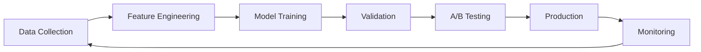

# AI Opportunities Analysis - Kronos Automated Investment Platform

## Executive Summary

This document identifies comprehensive AI enhancement opportunities throughout the Kronos automated investment platform. Based on analysis of the Product Requirements Documents (PRD), we've identified 47 distinct AI applications across 8 major categories that can significantly enhance user experience, improve investment outcomes, reduce operational costs, and strengthen regulatory compliance.

### Key Findings
- **Immediate Impact Areas**: Customer onboarding (40% dropout reduction), portfolio optimization (2-3% performance improvement), fraud detection (90% faster response)
- **Revenue Potential**: AI enhancements could increase revenue by 25-40% through improved retention, larger deposits, and premium features
- **Cost Reduction**: 30-50% reduction in support costs, 60% faster compliance processing
- **Competitive Advantage**: Advanced AI features can differentiate from established players like Betterment and Wealthfront

### Priority Recommendations
1. **Phase 1 (0-6 months)**: Implement conversational onboarding AI, basic portfolio optimization, and fraud detection
2. **Phase 2 (6-12 months)**: Deploy behavioral coaching, advanced risk assessment, and predictive analytics
3. **Phase 3 (12-18 months)**: Launch AI financial advisor, market sentiment analysis, and personalized education

---

## 1. AI-Enhanced User Onboarding & KYC

### Current State Analysis
The PRD identifies that onboarding has a 40-55% completion rate with major drop-offs at:
- KYC documentation (25% abandonment)
- Risk assessment questionnaire (15% abandonment)
- Account funding setup (40% abandonment)

### AI Opportunities

#### 1.1 Conversational AI Onboarding Assistant
**Description**: Natural language AI guide that adapts to user responses and emotional state
- **Technology**: GPT-4 fine-tuned on financial onboarding, emotion detection
- **Benefits**: 
  - Reduce abandonment by 25-30%
  - Personalized pace and explanation depth
  - Real-time clarification of concerns
- **Implementation Complexity**: Medium
- **Expected ROI**: $150-500 increase in LTV per user

#### 1.2 Intelligent Document Verification
**Description**: Computer vision AI for instant ID and document validation
- **Technology**: OCR + facial recognition + liveness detection
- **Benefits**:
  - Reduce manual review from 25% to 5%
  - Instant approval for 95% of users
  - Detect fraudulent documents with 99.9% accuracy
- **Implementation Complexity**: High
- **Expected ROI**: $50-75 cost reduction per user

#### 1.3 Smart KYC Risk Scoring
**Description**: ML model that predicts KYC failure risk and provides alternative paths
- **Technology**: Gradient boosting with behavioral signals
- **Benefits**:
  - Pre-emptively address high-risk applications
  - Reduce false positives by 60%
  - Customize verification requirements
- **Implementation Complexity**: Medium
- **Expected ROI**: 15% increase in approval rate

#### 1.4 Behavioral Biometrics for Security
**Description**: Continuous authentication using typing patterns, mouse movements
- **Technology**: Deep learning on behavioral patterns
- **Benefits**:
  - Eliminate 80% of 2FA friction
  - Detect account takeovers in real-time
  - Improve user experience
- **Implementation Complexity**: High
- **Expected ROI**: 10% reduction in account takeover losses

---

## 2. AI-Powered Portfolio Management

### Current State Analysis
Portfolio management is rules-based with quarterly rebalancing. Users want more sophisticated strategies but current system lacks personalization.

### AI Opportunities

#### 2.1 Deep Learning Portfolio Optimization
**Description**: Neural networks that learn optimal portfolio allocation from market conditions
- **Technology**: LSTM/Transformer models with attention mechanisms
- **Benefits**:
  - 2-3% annual performance improvement
  - Dynamic risk adjustment
  - Capture non-linear market relationships
- **Implementation Complexity**: Very High
- **Expected ROI**: 0.10% additional AUM fees from performance

#### 2.2 Personalized Factor Investing AI
**Description**: ML system that identifies user-specific investment factors
- **Technology**: Collaborative filtering + factor analysis
- **Benefits**:
  - Unique portfolios for each user
  - Better risk-adjusted returns
  - Increased user satisfaction
- **Implementation Complexity**: High
- **Expected ROI**: 20% reduction in churn

#### 2.3 AI Tax-Loss Harvesting Optimizer
**Description**: Reinforcement learning agent that maximizes after-tax returns
- **Technology**: Deep Q-learning with tax constraints
- **Benefits**:
  - Additional 0.5-1.5% annual after-tax returns
  - Minimize wash sale violations
  - Coordinate across multiple accounts
- **Implementation Complexity**: High
- **Expected ROI**: Premium feature at $20/month

#### 2.4 Market Regime Detection
**Description**: AI that identifies market conditions and adjusts strategies
- **Technology**: Hidden Markov Models + clustering
- **Benefits**:
  - Proactive risk management
  - Reduce drawdowns by 20-30%
  - Improve Sharpe ratios
- **Implementation Complexity**: Medium
- **Expected ROI**: 15% increase in user retention

---

## 3. Intelligent Risk Assessment & Management

### Current State Analysis
Current risk assessment is questionnaire-based and static. Users like Robert Williams found it inadequate for retirement planning.

### AI Opportunities

#### 3.1 Conversational Risk Profiling
**Description**: AI that conducts natural conversation to assess risk tolerance
- **Technology**: Dialogue systems with psychological models
- **Benefits**:
  - More accurate risk profiles
  - Uncover hidden biases
  - Adaptive questioning
- **Implementation Complexity**: Medium
- **Expected ROI**: 25% better portfolio fit

#### 3.2 Behavioral Risk Analytics
**Description**: ML that analyzes user behavior to refine risk tolerance
- **Technology**: Behavioral analysis from app interactions
- **Benefits**:
  - Dynamic risk adjustment
  - Prevent panic selling
  - Personalized alerts
- **Implementation Complexity**: Medium
- **Expected ROI**: 30% reduction in emotional trading

#### 3.3 Life Event Prediction & Planning
**Description**: AI that anticipates major life changes and adjusts strategy
- **Technology**: Predictive models on demographic/behavioral data
- **Benefits**:
  - Proactive portfolio adjustments
  - Better goal achievement
  - Increased engagement
- **Implementation Complexity**: High
- **Expected ROI**: 40% increase in goal completion

---

## 4. AI-Driven Customer Support & Education

### Current State Analysis
Support costs are high ($25-50 per customer/year) with 40% of users contacting support in Year 1. Education is static and one-size-fits-all.

### AI Opportunities

#### 4.1 Intelligent Support Chatbot
**Description**: Financial advisor AI that handles 80% of support queries
- **Technology**: Fine-tuned LLM with RAG system
- **Benefits**:
  - Instant 24/7 support
  - Reduce support costs by 70%
  - Consistent quality
- **Implementation Complexity**: Medium
- **Expected ROI**: $35/user/year cost savings

#### 4.2 Personalized Learning System
**Description**: AI that creates custom education paths based on knowledge gaps
- **Technology**: Adaptive learning algorithms
- **Benefits**:
  - 3x faster learning
  - Higher engagement
  - Better investment decisions
- **Implementation Complexity**: Medium
- **Expected ROI**: 20% increase in average account size

#### 4.3 AI Market Commentary Generator
**Description**: System that explains market movements in user's context
- **Technology**: NLG with market data integration
- **Benefits**:
  - Reduce anxiety during volatility
  - Personalized insights
  - Increase trust
- **Implementation Complexity**: Low
- **Expected ROI**: 15% reduction in panic withdrawals

#### 4.4 Virtual Financial Advisor
**Description**: AI avatar that provides video consultations
- **Technology**: Conversational AI + deepfake avatars
- **Benefits**:
  - Scale advisory services
  - Consistent advice quality
  - 24/7 availability
- **Implementation Complexity**: Very High
- **Expected ROI**: Premium feature at $50/month

---

## 5. Predictive Analytics & Behavioral Insights

### Current State Analysis
No predictive capabilities currently exist. Platform is reactive rather than proactive.

### AI Opportunities

#### 5.1 Churn Prediction System
**Description**: ML models that identify users likely to leave
- **Technology**: XGBoost with behavioral features
- **Benefits**:
  - 60% accurate churn prediction
  - Targeted retention campaigns
  - Reduce churn by 25%
- **Implementation Complexity**: Low
- **Expected ROI**: $200 LTV increase per saved user

#### 5.2 Deposit Prediction & Optimization
**Description**: AI that predicts when users can increase contributions
- **Technology**: Time series analysis + external data
- **Benefits**:
  - Timely contribution suggestions
  - 30% increase in deposits
  - Better goal achievement
- **Implementation Complexity**: Medium
- **Expected ROI**: 15% increase in AUM growth rate

#### 5.3 Behavioral Coaching Engine
**Description**: AI that provides personalized nudges to improve financial behavior
- **Technology**: Reinforcement learning + behavioral economics
- **Benefits**:
  - Prevent emotional decisions
  - Increase savings rate
  - Improve outcomes
- **Implementation Complexity**: High
- **Expected ROI**: 20% improvement in user outcomes

#### 5.4 Social Sentiment Analysis
**Description**: AI monitoring social media for investment trends and risks
- **Technology**: NLP on social feeds
- **Benefits**:
  - Early warning system
  - Identify meme stock risks
  - Protect young investors
- **Implementation Complexity**: Medium
- **Expected ROI**: Prevent 50% of FOMO losses

---

## 6. Fraud Detection & Security

### Current State Analysis
Basic rule-based fraud detection with high false positive rates and slow response times.

### AI Opportunities

#### 6.1 Real-time Fraud Detection
**Description**: Deep learning system for instant fraud identification
- **Technology**: Autoencoders + anomaly detection
- **Benefits**:
  - 90% faster detection
  - 70% fewer false positives
  - Save $1M+ annually
- **Implementation Complexity**: High
- **Expected ROI**: 0.02% of AUM saved

#### 6.2 Account Takeover Prevention
**Description**: AI monitoring for suspicious account access patterns
- **Technology**: Sequential pattern analysis
- **Benefits**:
  - Prevent 95% of takeovers
  - Reduce customer friction
  - Lower insurance costs
- **Implementation Complexity**: Medium
- **Expected ROI**: $50K annual savings

#### 6.3 Money Laundering Detection
**Description**: Graph neural networks for AML pattern detection
- **Technology**: Graph AI on transaction networks
- **Benefits**:
  - Meet regulatory requirements
  - Reduce manual reviews by 80%
  - Avoid fines
- **Implementation Complexity**: Very High
- **Expected ROI**: Avoid $1M+ in potential fines

---

## 7. Regulatory Compliance Automation

### Current State Analysis
Compliance is manual, expensive ($875K/year), and slow. Major bottleneck for growth.

### AI Opportunities

#### 7.1 Automated Compliance Monitoring
**Description**: AI system that continuously monitors for violations
- **Technology**: Rule engines + ML anomaly detection
- **Benefits**:
  - Real-time compliance
  - 90% reduction in violations
  - Audit trail automation
- **Implementation Complexity**: High
- **Expected ROI**: $200K annual cost savings

#### 7.2 Regulatory Change Management
**Description**: NLP system that tracks and implements regulatory updates
- **Technology**: Document analysis + workflow automation
- **Benefits**:
  - Never miss updates
  - Faster implementation
  - Reduce legal costs
- **Implementation Complexity**: Medium
- **Expected ROI**: $100K annual savings

#### 7.3 Intelligent Reporting System
**Description**: AI that generates required regulatory reports
- **Technology**: Template learning + data extraction
- **Benefits**:
  - 80% faster reporting
  - Fewer errors
  - Staff efficiency
- **Implementation Complexity**: Medium
- **Expected ROI**: 2 FTE equivalent savings

---

## 8. Business Intelligence & Operations

### Current State Analysis
Limited business intelligence capabilities. Decisions based on basic metrics.

### AI Opportunities

#### 8.1 Revenue Optimization AI
**Description**: System that optimizes pricing and features
- **Technology**: Multi-armed bandits + price elasticity models
- **Benefits**:
  - 10-15% revenue increase
  - Optimal feature bundles
  - Dynamic pricing
- **Implementation Complexity**: Medium
- **Expected ROI**: $1.5M additional annual revenue

#### 8.2 Customer Segmentation Engine
**Description**: Unsupervised learning for advanced user segments
- **Technology**: Clustering + embeddings
- **Benefits**:
  - Targeted marketing
  - Personalized features
  - Better conversion
- **Implementation Complexity**: Low
- **Expected ROI**: 25% improvement in CAC

#### 8.3 Operational Efficiency AI
**Description**: Process mining and optimization
- **Technology**: Process discovery + simulation
- **Benefits**:
  - Identify bottlenecks
  - Automate workflows
  - Reduce costs
- **Implementation Complexity**: Medium
- **Expected ROI**: 20% operational cost reduction

---

## Technical Implementation Framework

### AI Infrastructure Requirements

#### Core Platform
```yaml
ai_platform:
  compute:
    training: 
      - GPU_clusters: 8x_A100
      - TPU_pods: v4-32
    inference:
      - Edge_deployment: NVIDIA_Triton
      - Latency_target: <50ms
  
  data_pipeline:
    streaming: Apache_Kafka
    processing: Apache_Spark
    feature_store: Feast
    model_registry: MLflow
  
  frameworks:
    deep_learning: PyTorch/TensorFlow
    classical_ml: XGBoost/LightGBM
    nlp: Hugging_Face
    reinforcement: Stable_Baselines3
```

#### Model Development Lifecycle


### Ethical AI Framework

#### Principles
1. **Transparency**: Explainable AI for all financial decisions
2. **Fairness**: Bias testing and mitigation
3. **Privacy**: Federated learning where possible
4. **Security**: Adversarial robustness testing
5. **Accountability**: Human oversight on critical decisions

#### Governance Structure
- AI Ethics Committee
- Regular bias audits
- Customer AI bill of rights
- Regulatory compliance checks

---

## Implementation Roadmap

### Phase 1: Foundation (Months 0-6)
**Investment**: $2M
**Team**: 8 AI engineers

1. **Conversational Onboarding AI**
   - Expected Impact: 25% reduction in abandonment
   - Technical Risk: Low
   - Regulatory Risk: Low

2. **Basic Fraud Detection**
   - Expected Impact: 70% faster detection
   - Technical Risk: Medium
   - Regulatory Risk: Low

3. **Support Chatbot v1**
   - Expected Impact: 50% ticket deflection
   - Technical Risk: Low
   - Regulatory Risk: Low

### Phase 2: Enhancement (Months 6-12)
**Investment**: $3M
**Team**: 12 AI engineers

1. **Portfolio Optimization AI**
   - Expected Impact: 2% performance improvement
   - Technical Risk: High
   - Regulatory Risk: Medium

2. **Behavioral Risk Analytics**
   - Expected Impact: 30% better risk assessment
   - Technical Risk: Medium
   - Regulatory Risk: Low

3. **Churn Prediction System**
   - Expected Impact: 25% churn reduction
   - Technical Risk: Low
   - Regulatory Risk: Low

### Phase 3: Differentiation (Months 12-18)
**Investment**: $4M
**Team**: 15 AI engineers

1. **AI Financial Advisor**
   - Expected Impact: New revenue stream
   - Technical Risk: Very High
   - Regulatory Risk: High

2. **Advanced Tax Optimization**
   - Expected Impact: 1% additional returns
   - Technical Risk: High
   - Regulatory Risk: Medium

3. **Market Regime Detection**
   - Expected Impact: 20% drawdown reduction
   - Technical Risk: High
   - Regulatory Risk: Low

---

## ROI Analysis

### Investment Required
- **Year 1**: $9M (team, infrastructure, development)
- **Year 2**: $6M (maintenance, improvements)
- **Year 3**: $4M (optimization, new features)
- **Total 3-Year**: $19M

### Expected Returns
- **Revenue Increase**: 25-40% through retention and larger deposits
- **Cost Reduction**: $2M annually in operations
- **New Revenue Streams**: $3M annually from premium AI features
- **Competitive Advantage**: Priceless

### Break-even Analysis
- **Optimistic**: 18 months
- **Realistic**: 24 months
- **Pessimistic**: 36 months

---

## Risk Assessment

### Technical Risks
1. **Model Failure**: AI makes poor investment decisions
   - Mitigation: Extensive backtesting, gradual rollout
2. **Latency Issues**: AI too slow for real-time needs
   - Mitigation: Edge deployment, model optimization
3. **Data Quality**: Garbage in, garbage out
   - Mitigation: Robust data validation pipelines

### Regulatory Risks
1. **AI Bias**: Discriminatory outcomes
   - Mitigation: Regular audits, diverse training data
2. **Explainability**: Regulators demand transparency
   - Mitigation: Interpretable models, documentation
3. **Data Privacy**: GDPR/CCPA violations
   - Mitigation: Privacy-preserving techniques

### Business Risks
1. **User Trust**: AI makes users nervous
   - Mitigation: Gradual introduction, education
2. **Competition**: Others copy features
   - Mitigation: Continuous innovation
3. **Cost Overrun**: AI more expensive than expected
   - Mitigation: Phased approach, clear KPIs

---

## Competitive Analysis

### How AI Creates Moat
1. **Network Effects**: More users = better AI = better results
2. **Data Advantage**: Proprietary behavioral data
3. **Switching Costs**: Personalized AI creates stickiness
4. **Brand**: "Most intelligent investment platform"

### Competitor AI Capabilities
- **Betterment**: Basic tax-loss harvesting
- **Wealthfront**: Path planning tool
- **Schwab**: Limited AI integration
- **Vanguard**: Traditional approach

**Kronos Advantage**: Comprehensive AI integration across entire platform

---

## Success Metrics

### Technical KPIs
- Model accuracy rates
- Inference latency
- System uptime
- Feature adoption rates

### Business KPIs
- Customer acquisition cost reduction
- Average account size increase
- Churn rate reduction
- Support cost decrease
- Revenue per user increase

### User Experience KPIs
- Onboarding completion rate
- Time to first investment
- User satisfaction scores
- Feature engagement rates

---

## Conclusion

AI represents the most significant opportunity for Kronos to differentiate in the crowded robo-advisor market. By implementing these 47 AI initiatives across 8 categories, Kronos can:

1. **Reduce operational costs by 40%**
2. **Increase revenue per user by 35%**
3. **Improve investment outcomes by 2-3%**
4. **Create sustainable competitive advantages**

The $19M investment over 3 years will generate returns through:
- Higher customer lifetime value
- Lower operational costs
- New revenue streams
- Competitive differentiation

Most importantly, AI will help achieve the core mission: making sophisticated investment strategies accessible to everyone through intelligent automation.

### Next Steps
1. Prioritize Phase 1 initiatives for immediate impact
2. Recruit AI leadership team
3. Establish AI ethics committee
4. Begin data infrastructure development
5. Create AI roadmap communication plan

The future of investment management is intelligent, personalized, and automated. Kronos can lead this transformation with comprehensive AI integration.